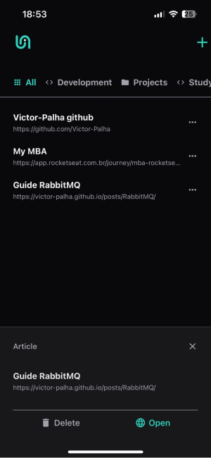

# Link Saver - Native
## Overview

Link Saver - Native is a mobile application designed to help users save, categorize, and manage their favorite links. Built using React Native, Expo, and TailwindCSS, this app provides a seamless and intuitive user experience for organizing links into various categories.

## Images

Here are some screenshots of the Link Saver - Native app:




## Features

- **Add Links**: Easily add new links with a name, URL, and category.
- **Categorize Links**: Organize links into predefined categories for easy access.
- **View Links**: Browse through saved links in a user-friendly interface.
- **EDelete Links**: Modify or remove links as needed.
- **Open Links**: Open saved links directly from the app.
- **Responsive Design**: Optimized for both Android and iOS devices.

## Installation

To get started with Link Saver - Native, follow these steps:

1. **Clone the repository**:
```sh
    git clone https://github.com/Victor-Palha/linkSaverNative.git
    cd linksSaverNative
```

2. **Install dependencies**:
```sh
    npm install
```

3. **Start the development server**:
```sh
    npm start
```

4. **Run on your device**:
    - For Android:
    ```sh
        npm run android
    ```
    - For iOS:
    ```sh
        npm run ios
    ```

## Usage

1. **Add a New Link**:
    - Navigate to the "Add" screen.
    - Enter the link name, URL, and select a category.
    - Press the "Add" button to save the link.

2. **View Links**:
    - Links are displayed in a list format, categorized for easy browsing.
    - Tap on a link to view more details or open/delete the link.

3. **Manage Categories**:
    - Categories can be selected from a predefined list.
    - Links can be filtered by category for better organization.

## Contributing

We welcome contributions to improve Link Saver - Native. To contribute, please follow these steps:

1. Fork the repository.
2. Create a new branch (`git checkout -b feature/your-feature-name`).
3. Make your changes and commit them (`git commit -m 'Add some feature'`).
4. Push to the branch (`git push origin feature/your-feature-name`).
5. Open a pull request.

## License

This project is licensed under the MIT License. See the [LICENSE](LICENSE) file for details.

## Acknowledgements

- [React Native](https://reactnative.dev/)
- [Expo](https://expo.dev/)
- [TailwindCSS](https://tailwindcss.com/)
- [NativeWind](https://www.nativewind.dev/)

## Contact

For any inquiries or feedback, please contact us at [jv.palha@gmail.com].
